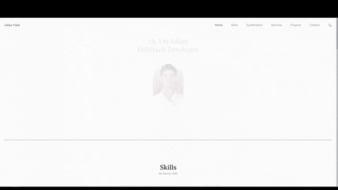

# Hi! Welcome to my Portfolio!

I really enjoyed the process of creating this project, as it helped me learn and apply the skills I have acquired. If you have any questions or need to contact me, you can do so through my contact information, which can be found on the website.

- It's made with HTML, CSS and JS
- It's fully responsive
- It contains light theme and dark theme
- [Swiper](https://swiperjs.com/) for creating carousels
- [ScrollReveal](https://scrollrevealjs.org/) to add animations when scrolling
- [EmailJS](https://www.emailjs.com/) to handle sending emails from the website.

## Here's the [preview](https://juli-cvidal.github.io/Juli-Vidal/):

>Pd: I am making a list of the things [I have learned](What%20I%20have%20learned/readme.md), I hope you like it!